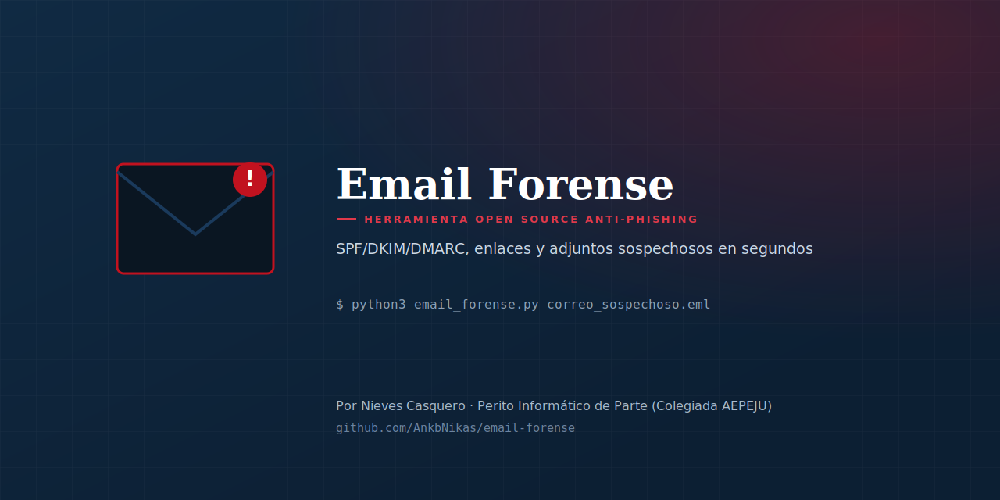

<p align="center">
  
</p>

<p align="center">
  
  
  
</p>

# Email Forense

Herramienta de línea de comandos que analiza un correo electrónico exportado en formato **.eml** en busca de indicios de phishing: fallos de autenticación (SPF/DKIM/DMARC), discrepancias entre remitente y Reply-To, enlaces sospechosos y adjuntos de riesgo. Todo con la **librería estándar de Python** — sin dependencias, sin enviar el correo a ningún servicio externo.

## Cómo exportar un correo a .eml

- **Gmail**: abrir el correo → menú (⋮) → "Mostrar original" → "Descargar original"
- **Outlook**: abrir el correo → Archivo → Guardar como → tipo "Correo electrónico"
- **Thunderbird**: arrastrar el correo a una carpeta del escritorio

## Ejemplo real

```
$ python3 email_forense.py correo_sospechoso.eml

[*] Riesgo: ALTO (puntuación 36)
```

```
## Cabeceras y autenticación

- El dominio de 'Reply-To' (atencion-clientes.xyz) no coincide con el de
  'From' (santander-verificacion.top).
- SPF ha fallado (fail) — indicio fuerte de suplantación.
- DKIM ha fallado (fail) — indicio fuerte de suplantación.
- DMARC ha fallado (fail) — indicio fuerte de suplantación.

## Adjuntos

- 🔴 Adjunto 'factura.pdf.exe': doble extensión — técnica para disfrazar
  un ejecutable como si fuera un documento.
```

Frente a un correo legítimo del mismo tipo, con SPF/DKIM/DMARC en `pass` y sin discrepancias, la puntuación es 0.

## Instalación

```bash
git clone https://github.com/AnkbNikas/email-forense.git
cd email-forense
```

No requiere instalar ningún paquete — solo Python 3.8 o superior.

## Uso

```bash
python3 email_forense.py correo.eml
python3 email_forense.py correo.eml --salida informe_caso12
```

## Qué comprueba

- 📋 **Cabeceras**: discrepancias entre From / Reply-To / Return-Path
- ✅ **Autenticación**: resultados de SPF, DKIM y DMARC (cabecera Authentication-Results)
- 🔗 **Enlaces**: truco del `@`, IPs en vez de dominio, Punycode, acortadores, TLDs de riesgo
- 📎 **Adjuntos**: extensiones ejecutables, macros de Office, doble extensión
- ⚠️ **Lenguaje de urgencia**: términos habituales en ingeniería social ("urgente", "cuenta suspendida"...)

## ⚖️ Límites — lectura obligatoria

- Es un análisis **heurístico y estructural**, no consulta listas negras de phishing en tiempo real ni analiza el contenido de las webs enlazadas.
- La cabecera `Authentication-Results` la genera el servidor que recibió el correo — si el .eml se ha reenviado o editado, puede faltar o no ser fiable.
- Ausencia de indicios no garantiza que el correo sea legítimo. Presencia de indicios no es prueba definitiva de phishing — son señales de alerta, no un veredicto.

## Otras herramientas de la misma serie

- [QR Forense](https://github.com/AnkbNikas/quishing-detector) — analiza el riesgo de phishing de un código QR
- [PDF Forense](https://github.com/AnkbNikas/pdf-forense) — detecta revisiones ocultas y redacciones defectuosas en PDF
- [Captura Forense](https://github.com/AnkbNikas/captura-forense) — detecta indicios de edición en imágenes
- [Cadena de Custodia Digital](https://github.com/AnkbNikas/cadena-custodia) — genera actas de cadena de custodia con hashes y sello de tiempo

## Licencia

MIT — ver [LICENSE](./LICENSE).

## Autora

**Nieves Casquero** — Perito Informático de Parte (Colegiada AEPEJU), Especialista en Ciberseguridad y Pentester

- GitHub: [@AnkbNikas](https://github.com/AnkbNikas)
- Web: [nievescasquero.github.io](https://nievescasquero.github.io)
- LinkedIn: [nieves-kaskero](https://www.linkedin.com/in/nieves-kaskero/)

Si te resulta útil, una ⭐ en el repositorio ayuda a que llegue a más gente antes de que caiga en un correo falso.
